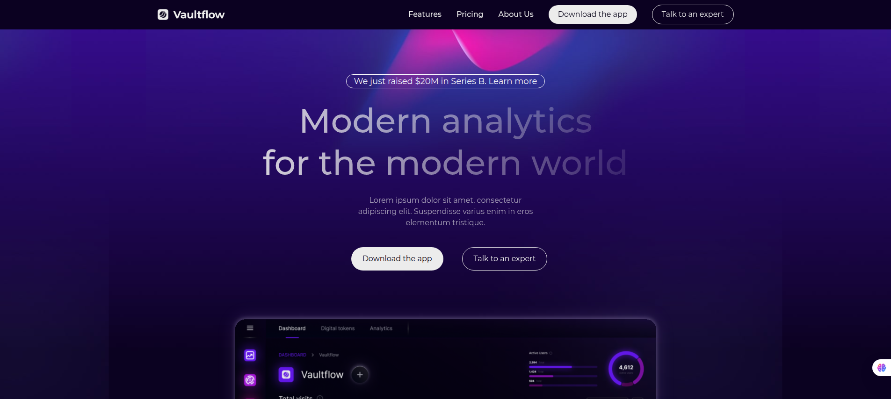
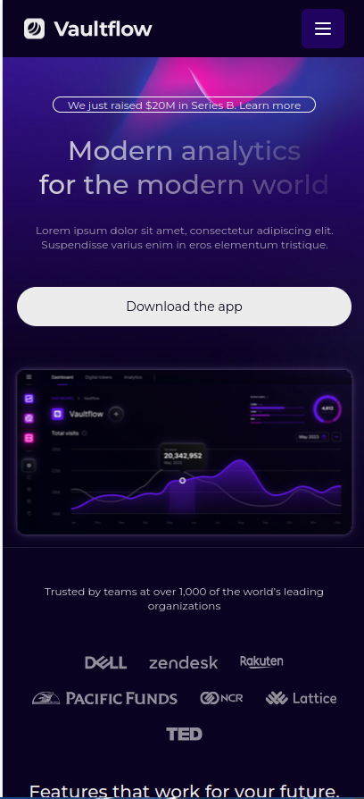

# 🎯 Landing Page: Figma To Code
---

## 🖼️ Aperçu du rendu

### 💻 Version desktop

### 📱 Version mobile

---

## 🔗 Liens utiles

- 🎨 [Lien vers la maquette Figma](https://www.figma.com/design/3xwYqxhJkfVyqwJ82iYJeZ/Challenge-FtoC?node-id=0-1&p=f&t=hpnQHB1kdBJg4HMO-0)
- 🌐 [Voir le site en ligne](https://mardino229.github.io/FTC-W1-Mardino/)
- 💻 [Code source sur GitHub](https://github.com/Mardino229/FTC-W1-Mardino)

---

## 🛠️ Stack technique

- React ⚛️
- TypeScript 🟦
- TailwindCss 🌬️

---

## 📱 Responsive

Le site est responsive :  
✅ Mobile  
✅ Tablette  
✅ Desktop

---

## 📌 À propos du challenge

**Figma to Code** est un challenge sur 4 semaines avec pour but de coder chaque semaine une nouvelle maquette Figma.

---

## ©️ Auteur

Voir mon linkedin **[Mardino DASSI](www.linkedin.com/in/maxime-mardino-dassi)**  

